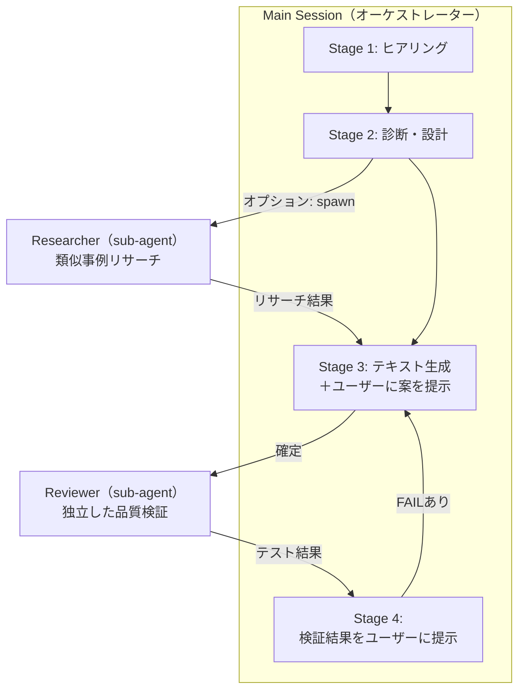

# アーキテクチャ

現在のdeep-reframeスキルのワークフローとエージェント構成。

## ワークフロー



## エージェント構成

| エージェント | 役割 | 実行場所 | 使用ツール |
|---|---|---|---|
| オーケストレーター | ヒアリング・診断・設計・テキスト生成・ユーザー対話 | Main Session | 全ツール |
| Researcher | 類似事例リサーチ | Sub-agent（オプション） | WebSearch, WebFetch, Read |
| Reviewer | 完成テキストの独立検証 | Sub-agent | なし（入力テキストの評価のみ） |
| Writer | テキスト案の生成 | Sub-agent（オプション、未使用） | Read |

### Writer sub-agentについて

Writer sub-agentは設計・実装済み（`agents/writer.md`）だが、デフォルトでは使用しない。

**経緯（Issue #3）:**
- 仮説: 診断と執筆を分離すれば認知的バイアスが減り品質が上がる
- eval結果: 全体+0.11（誤差範囲）。5点項目は2→6に増加したが、1ケースで回帰あり
- 原因: メリット（バイアス分離）とデメリット（コンテキスト欠落）が相殺
- 結論: オプション化。デフォルトはオーケストレーターが直接生成

使う場合はWriting Briefを作成してsub-agentに渡す（SKILL.md Stage 3参照）。

## ファイル構成

```
skills/deep-reframe/
├── SKILL.md                    # ワークフロー（オーケストレーション）
├── agents/
│   ├── researcher.md           # Researcher sub-agent プロンプト
│   ├── writer.md               # Writer sub-agent プロンプト（オプション）
│   └── reviewer.md             # Reviewer sub-agent プロンプト
├── references/
│   ├── references.md           # 診断基準・フレームワーク要約・テンプレート
│   ├── frameworks.md           # フレームワークの背景・解説
│   └── examples.md             # Before/After変換例
└── evals/
    └── evals.json              # evalケースとルーブリック評価基準
```

## 設計原則

詳細は [division-of-labor-design.md](division-of-labor-design.md) を参照。

- **認知的バイアスの分離**: ステージの分割ではなく、バイアスを断ち切る分離が目的
- **ヒアリングと診断は統合**: 良い質問には分析的思考が必要。分離すると対話の文脈が失われる
- **Reviewerは生成過程を知らない**: 完成テキストと正解情報だけで評価する
