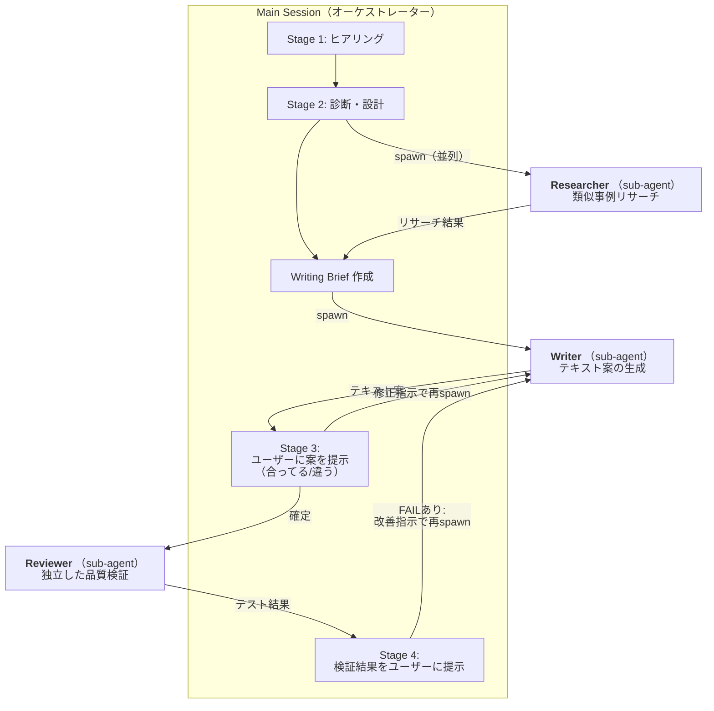
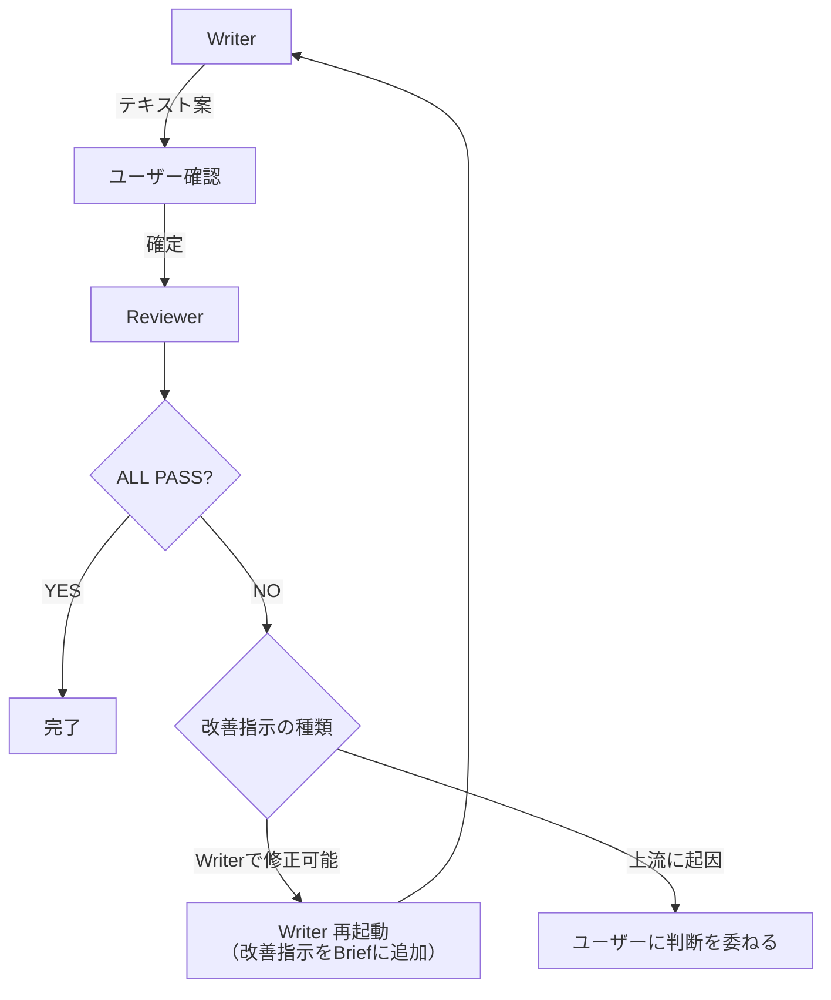

# 分業態勢の詳細設計

Issue: #2

## 背景と目的

現行のdeep-reframeは1エージェントが全工程（ヒアリング→診断→生成→検証）を担っている。これがテキスト品質のボトルネックになっている。

| 問題 | 原因 |
|---|---|
| 表現が診断の枠に引きずられる | 診断した本人が書く |
| リサーチが浅い | 直列で時間がかかるため省略されがち |
| 検証が甘い | 自分の出力を自分で評価する |
| 後半の品質が落ちる | 対話が長くなりコンテキストが劣化する |

分業の切り口は「ワークフローのステージをそのまま分ける」ではなく「認知的バイアスを断ち切る分離」。

## エージェント構成



### ヒアラー/アナリストの統合判断

**結論: 統合する（分けない）。**

理由:
- 良い質問をするには分析的思考が必要であり、分離すると対話の文脈が失われるコストが大きい
- ヒアリングも診断もユーザーとの対話が必須で、main sessionに置くしかない
- ヒアリング中に得た微妙なニュアンス（「こういうのは違う」等）が診断の精度に直結する

---

## 各エージェントの詳細設計

### 1. Main Session（オーケストレーター兼ヒアラー兼アナリスト）

**責務:**
- ユーザーとの全対話を担当
- Stage 1（ヒアリング）とStage 2（診断・設計）を実行
- 各sub-agentの起動・結果の受け取り・ユーザーへの提示
- Writing Briefの作成（診断結果を構造化し、Writerへの入力にする）
- Writerの出力をユーザーに提示し、「合ってる/違う」のフィードバックを収集
- Reviewerの結果をユーザーに提示し、修正が必要か判断

**参照するリファレンス:**
- `references/references.md`（診断基準セクション）
- `references/frameworks.md`（ユーザーから質問されたとき）
- `references/examples.md`（変換の方向性に迷ったとき）

**出力する構造化データ:**

#### Research Brief（→ Researcher への入力）

```
## Research Brief

### 技術の概要
[ヒアリングで把握した技術の核心]

### 診断結果の要約
- 現在のPhase: [Phase X]
- 主要な問題パターン: [検出された問題]

### リサーチの焦点
- [技術の特性に基づく具体的なリサーチ質問]
- 例: 「シミュレーション領域でPhase 1→3の転換に成功した企業のメッセージング」
```

#### Writing Brief（→ Writer への入力）

```
## Writing Brief

### コンテキスト
- 技術の核心: [1段落で要約]
- ターゲット読者: [誰に読ませたいか]
- 閲覧場面: [どの場面で読まれるか]
- 期待するアクション: [読んだ後にどう動いてほしいか]

### 診断結果（構造化）
- 現在のPhase: [Phase X → 目標Phase Y]
- 検出された問題パターン: [番号とテキスト引用]
- 維持すべき要素: [既に効いている表現・数字]

### 作成するテキスト
- 種別: [タグライン / サービス説明 / 事例記事 等]
- 長さ: [短い / 長い]

### リサーチ結果（Researcherの出力）
- [類似事例の要約]
- [応用できるパターン]

### 制約
- [ユーザーが「違う」と言った方向性]
- [技術的に正確でなければならない表現]
- [前回のフィードバック（リトライの場合）]
```

---

### 2. Researcher（sub-agent）

**責務:**
- 診断結果に基づいて、類似の技術的パラダイムシフトの成功事例を調査
- 競合・類似企業のメッセージングパターンを収集
- 表現パターンの引き出しを広げる素材を集める

**入力:** Research Brief
**出力:** リサーチ結果（構造化テキスト）

```
## リサーチ結果

### 類似事例
- [企業名]: [技術概要] / [メッセージングの特徴] / [何が効いているか]
- ...

### 応用できるパターン
- [パターン1: 具体的な表現手法とその効果]
- ...
```

**使用ツール:** WebSearch, WebFetch, Read
**使用不可ツール:** Write, Edit, AskUserQuestion（ユーザー対話しない）

**起動タイミング:** Stage 2の診断完了後（ユーザーがリサーチを希望した場合）。Main SessionがStage 2の残りの作業（設計）を進めている間に並列で実行できる。

**context: fork を使う理由:** リサーチは独立したタスクであり、main sessionの会話履歴は不要。検索結果が大量になってもmain sessionのコンテキストを汚さない。

---

### 3. Writer（sub-agent）

**責務:**
- Writing Briefとリファレンスに基づいて、テキスト案を複数生成する
- 各案にどんな表現技法を使い、読者にどう作用するかの説明を添える
- フレームワークの選択・適用を行う

**入力:** Writing Brief + 前回のフィードバック（リトライの場合）
**出力:** テキスト案（構造化テキスト）

短いテキストの場合:
```
## 生成結果

### 方向性の選択肢
1. [方向性名]: [効果の説明]
2. [方向性名]: [効果の説明]
3. [方向性名]: [効果の説明]

### 各方向性の具体案（方向性ごとに最大3案）
#### 方向性1: [名前]
- 案A: [具体的な文面] — [表現技法と読者への効果]
- 案B: [具体的な文面] — [表現技法と読者への効果]
- 案C: [具体的な文面] — [表現技法と読者への効果]
```

長いテキストの場合:
```
## 生成結果

### 構成案（2〜3案）
#### 構成1: [構成名]
- [見出し1]: [要点]
- [見出し2]: [要点]
- ...
意図: [なぜこの構成が効くか]

### セクション本文（構成確定後、セクションごとに生成）
#### [セクション見出し]
[本文]
```

**参照するリファレンス:**
- `references/references.md`（生成リファレンスセクション — フレームワーク、表現パターン、テンプレート）
- `references/examples.md`（変換パターンの粒度・方向性の基準）

**使用ツール:** Read（リファレンス参照用のみ）
**使用不可ツール:** Write, Edit, WebSearch, WebFetch, AskUserQuestion

**context: fork を使う理由（最重要）:** 診断の思考過程がWriterに渡らないことで、認知的バイアスが断ち切られる。WriterはWriting Brief（構造化データ）とリファレンスだけを見て、より自由に表現を探れる。

**起動パターン:**
1. 初回: Writing Brief + リファレンスパスを渡して起動
2. リトライ: Writing Brief + ユーザーのフィードバック（「違う」の理由、制約）を追加して再起動
3. セクション単位: 長いテキストでは、構成確定後にセクションごとにWriterを起動

---

### 4. Reviewer（sub-agent）

**責務:**
- 完成したテキストを、生成過程を知らない状態で独立に検証する
- 3種類のテスト（理解度・アクション誘発・3層カバレッジ）を実行
- 問題を検出した場合、具体的な改善指示を出す

**入力:** 完成テキストのみ + 最低限のコンテキスト

```
## Review Request

### テキスト
[完成したテキスト全体]

### 最低限のコンテキスト（検証に必要な正解情報）
- この会社が実際にやっていること: [1行]
- ターゲット読者: [誰]
- 期待するアクション: [何をしてほしいか]

### テスト指示
1. 理解度テスト: テキストだけを読んで「何の会社か」「誰のどんな問題を解決するか」「競合との違いは」に答えよ
2. アクション誘発テスト: [ターゲット読者]として読み、問い合わせたいと思うか。理由と不足情報を述べよ
3. 3層カバレッジ: 事業成果 / 能力 / 技術的裏付けの3層がカバーされているか
```

**出力:** テスト結果と改善指示

```
## Review Result

### テスト1: 理解度
- 回答: [質問への回答]
- 判定: PASS / FAIL
- 問題箇所: [FAILの場合、何が読み取れなかったか]

### テスト2: アクション誘発
- 問い合わせたいか: YES / NO
- 理由: [...]
- 不足情報: [...]

### テスト3: 3層カバレッジ
- 事業成果: ✓ / ✗ [該当テキスト or 欠けている内容]
- 能力: ✓ / ✗
- 技術的裏付け: ✓ / ✗

### 改善指示（FAILがある場合）
- [具体的にどこをどう直すべきか]
```

**参照するリファレンス:** なし（テキストだけを見て判断する。リファレンスを見ると「フレームワークに沿っているか」という生成側の視点が混入する）

**使用ツール:** なし（入力テキストの評価のみ）
**使用不可ツール:** 全ツール不要（プロンプトへの応答のみ）

**context: fork を使う理由（最重要）:** 生成過程を一切知らない状態で評価することで、「自分の出力を自分で評価する甘さ」を排除する。Reviewerが見るのは完成テキストと正解情報だけ。

---

## 技術的実現方法

### 実装方針: 単一Skill + Agent tool による sub-agent 起動

**選んだ方式:** 現行のdeep-reframe SKILL.mdを拡張し、Agent toolでsub-agentを起動する。

**選ばなかった方式と理由:**

| 方式 | 不採用の理由 |
|---|---|
| 複数Skillに分割 | Skill間の直接呼び出しが不可。ユーザーが手動で順番に呼ぶ必要があり、体験が悪い |
| Agent Teams | 実験的機能。トークンコストが高い。このユースケースには過剰 |
| Hooks による段階管理 | 補助的には使えるが、分業の主軸にはならない |

### Agent tool の呼び出し方

SKILL.md内で、各ステージの該当箇所にAgent toolの呼び出し指示を記載する。

**Researcher の起動:**
```
Stage 2の診断完了後、ユーザーがリサーチを希望した場合:
- Research Briefを作成する
- Agent toolで Researcher を起動する（以下のプロンプトを使用）
- Researcherの実行中にStage 2の設計作業を並行して進めてよい
```

**Writer の起動:**
```
Stage 3でテキスト案を生成する際:
- Writing Briefを作成する
- Agent toolで Writer を起動する（以下のプロンプトを使用）
- Writerの出力をユーザーに提示し、フィードバックを受ける
- 修正が必要な場合、フィードバックをWriting Briefに追加して再起動する
```

**Reviewer の起動:**
```
Stage 4で検証を行う際:
- Review Requestを作成する
- Agent toolで Reviewer を起動する（以下のプロンプトを使用）
- Reviewerの出力をユーザーに提示する
- FAILがあればWriter を再起動して修正する
```

### sub-agent のプロンプト設計

各sub-agentのプロンプトは、SKILL.md内にインラインで記載するのではなく、以下の構造で管理する:

```
skills/deep-reframe/
├── SKILL.md                    # メインワークフロー（オーケストレーション指示を含む）
├── agents/
│   ├── researcher.md           # Researcher のシステムプロンプト
│   ├── writer.md               # Writer のシステムプロンプト
│   └── reviewer.md             # Reviewer のシステムプロンプト
├── references/
│   ├── references.md           # 操作リファレンス（診断基準・フレームワーク・テンプレート）
│   ├── frameworks.md           # フレームワークの背景・解説
│   └── examples.md             # Before/After変換例
```

SKILL.mdからAgent toolを呼ぶ際、プロンプトには:
1. 該当する `agents/*.md` の内容を読み込む指示
2. 構造化データ（Brief / Request）をインラインで埋め込む

---

## レビュアー→ライターのフィードバックループ

### 基本フロー



### ループの制御

1. **Writer → ユーザー → Writer のループ（Stage 3内）:**
   - ユーザーが「違う」と言った場合、理由を聞いて制約としてWriting Briefに追加
   - 修正されたBriefでWriterを再起動
   - ユーザーが「合ってる」と言えばStage 4（Reviewer）へ

2. **Reviewer → Writer のループ（Stage 4 → Stage 3）:**
   - ReviewerがFAILを出した場合、改善指示をWriting Briefに追加してWriterを再起動
   - Writerの修正案をユーザーに提示し、確認後に再度Reviewerへ
   - **上限: 2回まで。** 2回修正してもFAILが残る場合はユーザーに判断を委ねる

3. **上流に起因する問題:**
   - Reviewerが「テキストの問題ではなく、入力情報が不足している」と判断した場合
   - 例: 「競合との違いが書かれていない」→ ヒアリングで競合情報が不足
   - この場合はユーザーに「追加情報が必要」と伝え、ヒアリングに戻る

### フィードバックの構造化

Reviewer → Writer のフィードバックは以下の形式で構造化し、Writing Briefの「制約」セクションに追加する:

```
### Reviewer フィードバック（第N回）
- テスト結果: [PASS/FAIL の一覧]
- 問題箇所: [具体的なテキスト引用]
- 改善指示: [何をどう直すべきか]
- 優先度: [FAIL の深刻度順]
```

---

## 現行SKILL.mdからの変更点

### 変更が必要な箇所

| 箇所 | 現行 | 変更後 |
|---|---|---|
| Stage 2: リサーチ | main sessionが直列で実行 | Researcher sub-agentを並列起動 |
| Stage 3: テキスト生成 | main sessionが直接生成 | Writer sub-agentに委譲。ユーザー対話はmain sessionが継続 |
| Stage 4: 検証 | main sessionが自己評価 or 手動テスト案内 | Reviewer sub-agentで自動実行 |

### 変更しない箇所

- Stage 1（ヒアリング）: 変更なし
- Stage 2（診断・設計）: 診断ロジック自体は変更なし。Research Brief作成とResearcher起動を追加
- ユーザーとの対話フロー: 「案を出す→合ってる/違う」の設計原則は維持
- サクサク/じっくりモード: 変更なし（main sessionでの提示方法の話であり、分業とは独立）

### 新規作成するファイル

- `agents/researcher.md` — Researcher のシステムプロンプト
- `agents/writer.md` — Writer のシステムプロンプト（リファレンス参照指示、出力形式の指定を含む）
- `agents/reviewer.md` — Reviewer のシステムプロンプト（3つのテストの実行手順を含む）

